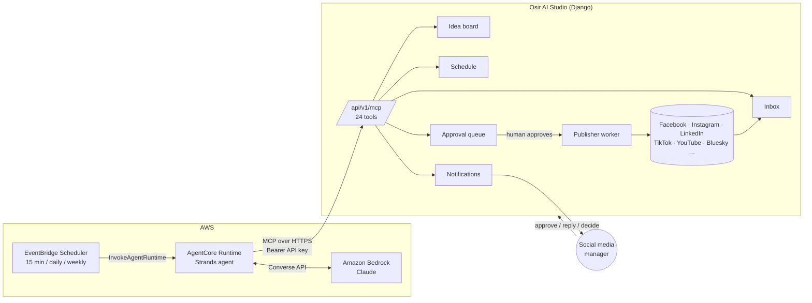

# Osir AI Autopilot

A [Strands Agents](https://strandsagents.com) agent that runs a social-media workspace in the background and only surfaces the decisions a person actually needs to make. Built for the AWS "Agents for Humans" hackathon, Professional Agents track.

## The problem

A social-media manager at an agency or small business loses hours a day to work that is repetitive but not quite mechanical: answering the same customer questions in comments and DMs, noticing that Thursday's slot is still empty and turning an idea card into a draft, and assembling the Monday "how did we do" summary. None of it is hard. All of it has to happen every day, and every item needs a little judgment, which is why it never gets automated with rules.

## What the agent does

Three loops, each one scheduled invocation of a Strands agent that acts through Studio's MCP tools:

| Loop | Cadence | Handles on its own | Surfaces to a human |
|---|---|---|---|
| **Inbox** | every 15 min | Replies to routine questions using the team's saved replies, thanks positive comments, resolves spam | Negative, complaint, refund, legal, ambiguous, or personal-data messages: adds an internal note with its reasoning and sends one `notify_team` decision |
| **Calendar** | daily | Finds posting slots with nothing planned, picks an unused idea card, writes a draft in the brand voice, links it to the idea | Submits the draft to the approval queue and sends one notification listing what awaits review. Schedules routine drafts itself only on the `autopilot` dial |
| **Digest** | weekly | Reads channel and post analytics, inbox volume, and next week's gaps | One digest notification with three concrete recommendations; respects quiet hours |

Plus an on-demand **command** mode for when a person wants something specific: "plan next week for the LinkedIn page", "schedule this on Thursday at 9", "how did last week's launch post do". Same tools, same rules.

The boundary between "handle it" and "ask a human" is written in plain language in `osir_agent/prompts.py`, so the team can read and change it.

## How much it may do: the autonomy dial

Workspace Settings → Approvals has an **Osir AI autopilot** setting the team controls:

| Level | Inbox | Content |
|---|---|---|
| `off` | observes and reports only | observes and reports only |
| `draft_only` (default) | replies to routine items, escalates the rest | creates drafts, every post goes through the approval queue |
| `autopilot` | same | may also schedule routine posts directly, if the approval workflow allows direct scheduling and the API key has `publish_directly`. Announcements, pricing, anything reputational still go to approval |

The agent reads this through the `get_workspace_policy` tool before it sees any other tool, and the scheduling tools are removed from its toolset unless all three conditions hold. The API key's permissions remain the hard gate on the server; the dial is the human's soft control on top.

## Architecture



Design choices:

- **Studio is the system of record; the agent has no database.** Every action goes through an MCP tool that re-checks the workspace permission and the API key's account allowlist, so the agent can never do more than the key it was issued.
- **Human decisions use surfaces the team already has.** Drafts land in the existing approval queue. Escalations and digests are ordinary Studio notifications (in-app, email, webhook, quiet hours), so nobody installs another app.
- **Every write is attributed to the human who issued the key**, exactly as if they had clicked the button. Audit trails stay intact.
- **Dry-run mode** hides every write tool, so you can watch the agent reason over a real workspace without it touching anything.

## Run it locally

```bash
cd agent
python -m venv .venv && source .venv/bin/activate
pip install -r requirements.txt

export STUDIO_URL=https://your-studio.example.com     # or http://localhost:8000
export STUDIO_API_KEY=bb_studio_...                    # Organization → API Keys, with use_inbox, reply_from_inbox, create_posts, view_analytics
export AWS_REGION=us-west-2                            # any region with Bedrock model access
# AWS credentials via env, profile, or IAM role

python run_local.py inbox --dry-run     # watch it think, no writes
python run_local.py inbox               # live
python run_local.py calendar
python run_local.py digest
python run_local.py all --every 900     # inbox + calendar every 15 minutes, no AWS scheduler needed
python run_local.py command "Plan next week for the LinkedIn page"
```

Optional: `OSIR_BRAND_VOICE="Friendly, concise, no emoji"`, `OSIR_MAX_REPLIES=10`, `OSIR_MAX_DRAFTS=3`, `BEDROCK_MODEL_ID=...`.

The API key needs `use_inbox` + `reply_from_inbox` (inbox loop), `create_posts` (calendar loop), and `view_analytics` (digest). Add `publish_directly` only if you want the `autopilot` level to schedule routine posts itself; without it the agent cannot publish no matter what the dial says.

## Deploy to Amazon Bedrock AgentCore

```bash
cd agent
npm install -g @aws/agentcore
agentcore create --project-name osir --name osir-agent --language Python --framework Strands --model-provider Bedrock --build Container
# point agentcore.json at this directory's Dockerfile, or copy main.py + osir_agent/ into the generated app/
agentcore deploy
agentcore invoke --prompt 'Plan next week for the LinkedIn page'     # a plain prompt runs as a command
# or a JSON payload: {"task":"inbox","dry_run":true}
```

Set `STUDIO_URL` and `STUDIO_API_KEY` as runtime environment variables (or an AgentCore Identity API-key credential provider). The container is `linux/arm64` and serves `/invocations` and `/ping` on port 8080 via `bedrock_agentcore.BedrockAgentCoreApp`.

Then create the schedules (no Lambda in between; EventBridge Scheduler calls `InvokeAgentRuntime` directly):

```bash
AGENT_RUNTIME_ARN=arn:aws:bedrock-agentcore:...:runtime/osir-agent-xyz \
SCHEDULER_ROLE_ARN=arn:aws:iam::123456789012:role/osir-scheduler \
./schedule/create_schedules.sh
```

## Tests

```bash
cd agent && pytest
```

The check that must never break: dry-run removes every tool that can reach a customer or a teammate.
